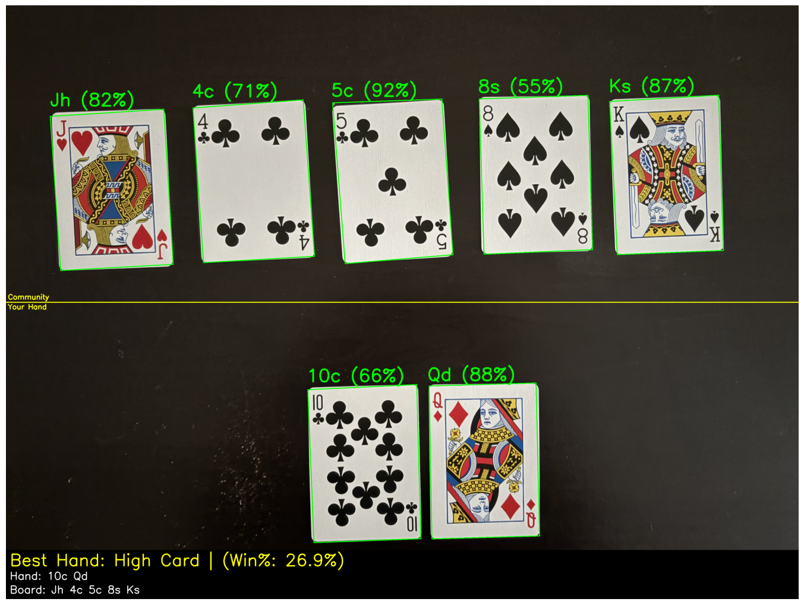
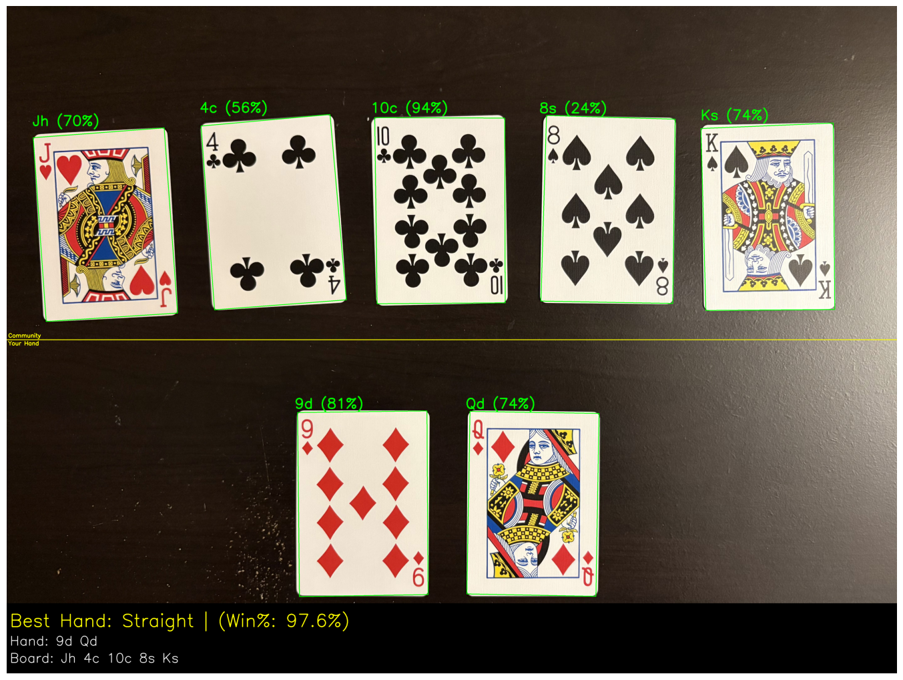

# Playing Card Detector
Real-time playing card detection using YOLOv8, OpenCV and treys. Detects card rank and suit, counts cards on screen, and displays live bounding boxes via webcam or video feed. Includes a poker hand evaluator that identifies your best hand and estimates win probability against a random opponent.

## Dataset 
- Dataset used for training from [Kaggle](https://www.kaggle.com/datasets/andy8744/playing-cards-object-detection-dataset) 

## Detect Example

<p align="center">
  
  &nbsp;
  
</p>

## Poker Notebook Example

<p align="center">
  
  &nbsp;
  
</p>


## Features
**Live Detection (detect.py)**
- Detects all 52 playing cards (rank + suit) in real-time
- Bounding boxes with confidence scores
- Full card contour detection using OpenCV adaptive thresholding
- Temporal smoothing across frames to reduce flickering
- Real-time card counting

**Poker Hand Evaluator (PokerAnalyzer.ipynb)**
- Place community cards in the top half of the frame, your hand in the bottom half
- Automatic zone detection splits cards by position using a visual midline
- Evaluates best 5-card poker hand (High Card → Royal Flush)
- Estimates win probability via 1000-hand Monte Carlo simulation against a random opponent
  
## Requirements
- Python 3.8+
- Ultralytics YOLOv8
- OpenCV
- NumPy
- Matplotlib
- [treys](https://github.com/ihendley/treys)

## Installation
```bash
git clone https://github.com/Sxres/PlayingCardsDetection
cd PlayingCardsDetection
uv sync 
```

## Usage

**Webcam:**
```bash
python detect.py
```

**Poker Hand Evaluator:**

Open `CardDetector.ipynb` and run through notebook:

```bash
In your image, place your 2 player cards in the bottom half of the frame and 5 community cards in the top half for the dealer.
```

## Project Structure
```
PlayingCardsDetection/
├── detect.py
├── PokerAnalyzer.ipynb
├── YoloCardTraining.ipynb
├── Runs/
├── models/
│   └── cards.pt
├── uv.lock
├── pyproject.toml
└── README.md
```

## Credits
- YOLOv8 by [Ultralytics](https://github.com/ultralytics/ultralytics)
- Big help from https://github.com/TeogopK/Playing-Cards-Object-Detection 


