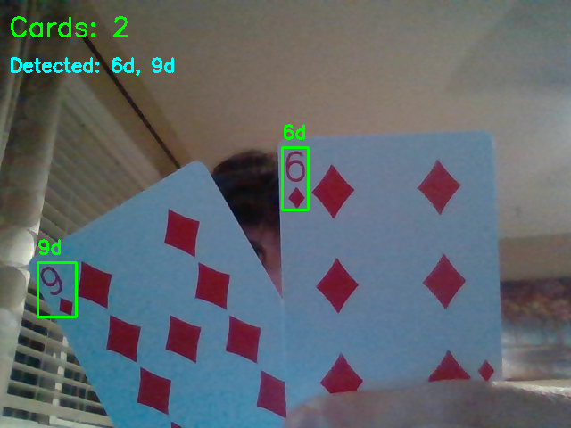
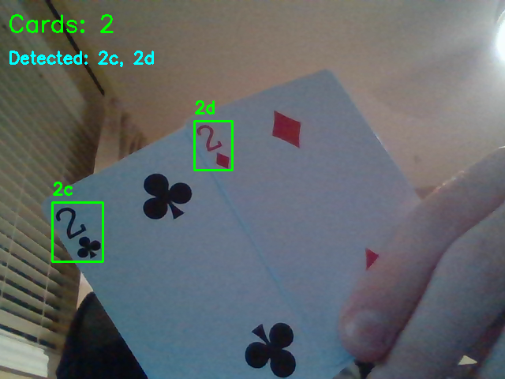

# Playing Card Detector

Real-time playing card detection using YOLOv26 and OpenCV. Detects card rank and suit, counts cards on screen, and displays live bounding boxes via webcam or video feed.

## Dataset 
- Dataset used for training from [Kaggle](https://www.kaggle.com/datasets/andy8744/playing-cards-object-detection-dataset) 

## Examples

<p align="center">
  
  &nbsp;
  
</p>


## Features
- Detects all 52 playing cards (rank + suit)
- Real-time card counting
- Works with webcam or video file
- Bounding boxes with confidence scores

## Requirements
- Python 3.8+
- Ultralytics YOLOv26
- OpenCV

## Installation
```bash
git clone https://github.com/Sxres/PlayingCardsDetection
cd PlayingCardsDetection
uv sync 
```

## Usage

**Webcam:**
```bash
python detect.py
```

**Video file:**
```bash
python detect.py --source myvideo.mp4
```

## Project Structure
```
PlayingCardsDetection/
├── detect.py
├── CardDetector.ipynb
├── YoloCardTraining.ipynb
├── Runs/
├── models/
│   └── cards.pt
├── uv.lock
├── pyproject.toml
└── README.md
```

## Credits
- YOLOv8 by [Ultralytics](https://github.com/ultralytics/ultralytics)
- Big help from https://github.com/TeogopK/Playing-Cards-Object-Detection 


